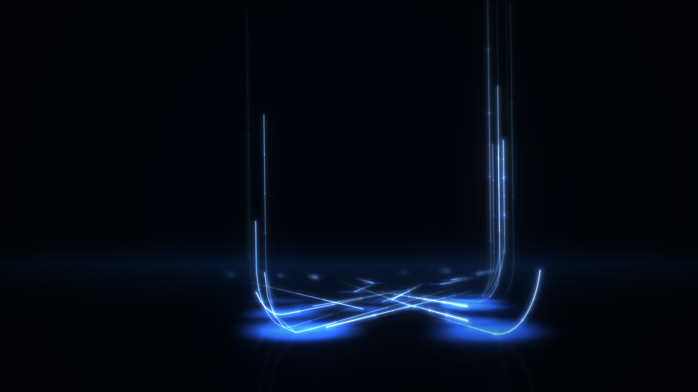

# Procedural Motion Backgrounds

Two looping, 100% procedural motion-graphics backgrounds built in Remotion.

Every pixel is generated in code — no stock footage, no image or video assets, no
fonts fetched at render time, no text, no watermarks.

**Neon Streaks** — glowing blue light streaks race in along a glossy floor, turn
90° at a rounded corner and climb out through the top of frame. 15s.



**Data Tunnel** — a flight down a corridor of glowing dot grids, through
atmospheric haze and drifting dust. 10s.


<sub>More stills in [`docs/`](docs/): streaks [frame 0](docs/preview-f0.png) · [vertical](docs/preview-vertical.png) · [title overlay](docs/preview-title.png), tunnel [vertical](docs/preview-tunnel-vertical.png).</sub>

## Compositions

| id                    | size        | length | notes                                             |
| --------------------- | ----------- | ------ | ------------------------------------------------- |
| `NeonStreaks`         | 1920 × 1080 | 450f   | the main streaks background                        |
| `NeonStreaksVertical` | 1080 × 1920 | 450f   | same code, no per-format tuning                    |
| `NeonStreaksAlpha`    | 1920 × 1080 | 450f   | no background fill or vignette, for a keyable pass |
| `TitleOverlay`        | 1920 × 1080 | 450f   | `title` / `subtitle` over the streaks, zod-typed   |
| `DataTunnel`          | 1920 × 1080 | 300f   | the dot-grid corridor                              |
| `DataTunnelVertical`  | 1080 × 1920 | 300f   | same code                                          |

All are 30 fps. 450 frames = 15s, 300 frames = 10s.

## Commands

```bash
npm i
npm run dev              # Remotion Studio
```

Render the main background:

```bash
npx remotion render NeonStreaks out/neon-streaks.mp4 --crf 16
```

The effect is pure 2D canvas, so **no `--gl=angle` flag is needed** — there is no
WebGL context to configure.

Vertical:

```bash
npx remotion render NeonStreaksVertical out/neon-streaks-vertical.mp4 --crf 16
```

Render the tunnel:

```bash
npx remotion render DataTunnel out/data-tunnel.mp4 --crf 16
npx remotion render DataTunnelVertical out/data-tunnel-vertical.mp4 --crf 16
```

### ProRes 4444 with alpha

Render the `NeonStreaksAlpha` composition, which skips the opaque background and
the black vignette so the alpha channel is real:

```bash
npx remotion render NeonStreaksAlpha out/neon-streaks-alpha.mov \
  --codec=prores --prores-profile=4444 --pixel-format=yuva444p10le \
  --image-format=png
```

`--image-format=png` is required and easy to miss: `remotion.config.ts` sets JPEG
frames (right for the mp4, and faster), and JPEG has no alpha channel, so without
this flag the render fails outright. Verified output is 50% fully transparent,
1.5% fully opaque cores and 48.5% partial — the halos really are semi-transparent.

Key it over other footage with a **screen / add** blend, not a luma key — the
streaks are additive light, and their halos are genuinely semi-transparent.
Add your own vignette downstream; baking a black one into an alpha pass would
print black into the matte.

### Title overlay

`title`, `subtitle`, `accent`, `startFrame` and `holdFrames` are typed with zod,
so they are editable in the Studio props panel:

```bash
npx remotion render TitleOverlay out/title.mp4 --crf 16 \
  --props='{"title":"Ship faster","subtitle":"Platform keynote","accent":"#7FC4FF","startFrame":18,"holdFrames":300}'
```

The text fades back out before the end, so this composition loops too.

## Verification

```bash
npm run check:loop   # proves the loop closes exactly
npm run stills       # renders frames 0, 60, 150, 300, 449
```

`check:loop` is the real test. Because every animated quantity is a pure function
of the frame number, "seamless" has an exact meaning: it asserts that the camera
pose, all 54 streak phases and the density envelope are *identical* at frame 0
and frame 450, at both aspect ratios, and that every streak's cycle count is a
whole number. Frame 449 then leads into frame 0 as an ordinary one-frame step.

If your environment already has a Chromium and you would rather Remotion not
download its own:

```bash
REMOTION_BROWSER=/path/to/chrome npm run stills
npx remotion render NeonStreaks out/neon-streaks.mp4 --crf 16 --browser-executable=/path/to/chrome
```

## Why 2D canvas rather than three.js

Both were on the table. The 2D route won on the merits, not just on speed:

- **The subject is a curve, not a solid.** A streak is a glowing 1–4px line along
  a rounded-corner path. In three.js that means tube geometry, an additive
  material and a bloom pass to fake something canvas draws natively as a stroked
  polyline with a width. The 3D version carries geometry you would immediately
  spend effort hiding.
- **The perspective needed is one line of maths.** Streaks live on a floor plane
  and a vertical climb; a pinhole projection plus a roll is the whole camera.
  A scene graph buys nothing here.
- **Determinism is free.** No GPU driver, no ANGLE backend, no `useFrame` deltas
  — identical output on every render worker, which is exactly what Remotion's
  parallel rendering needs.
- **Bloom is better, not worse.** The bloom is threshold-extracted (the streak
  buffer multiplied by itself, which squares colour and alpha) and then added
  back at four blur radii. Crushing the dim halo before blurring is what keeps
  bright cores blowing out while the frame stays black instead of washing to grey.

It renders in a couple of minutes on CPU with no GPU flags.

## Structure

```
src/lib/
  random.ts        mulberry32; seeded once at module scope, shared by both pieces
src/NeonStreaks/
  config.ts        every tunable — counts, speeds, palette, bloom, camera, density
  streaks.ts       the deterministic streak table + density envelope
  geometry.ts      camera, pinhole projection, the three-part streak path
  render.ts        the canvas pipeline
  NeonStreaks.tsx  the component
  TitleOverlay.tsx zod-typed title variant
src/DataTunnel/
  config.ts        every tunable — grid, fog, nebula, dust, bloom, palette
  tunnel.ts        camera, projection, plane curvature, the drifter tables
  render.ts        the canvas pipeline
  DataTunnel.tsx   the component
scripts/
  check-loop.mjs   loop invariant tests for both pieces
  stills.mjs       verification stills
```

### How a streak is built

Each streak is one continuous path in world space:

1. a run along the floor (`y = 0`), travelling toward the camera and yawed
   sideways,
2. a quarter-circle bend of `bendRadius`,
3. a straight climb, exiting through the top of frame.

A trail is the slice of that path between `head - trailLength` and `head`. The
head position is `phase × pathLength`, and `phase` advances by a **whole number**
of cycles per 450 frames — which is what closes the loop.

Two geometry choices carry the whole look, and both are in `config.ts`:

- **`streaks.lateralBand.inner`** keeps bends away from the frame centre. This is
  not just composition. A streak running straight at the camera near the centre
  projects its floor run to a near-vertical line — the same screen direction as
  the climb — so its 90° corner collapses into a hairpin. Offsetting the bend
  laterally (helped by `yawDeg`) is what makes the turn read as a turn.
- **`bend.depth`** varies per streak. With one shared bend depth, every climb
  starts at the same screen height and the floor runs bundle into a flat band;
  varying it is what gives the piece depth.

## How the tunnel is built

Two dot-grid planes run the length of a corridor, one above the camera axis and
one below, bowing away from the axis toward the sides. The camera flies forward;
dots stream outward from the vanishing point.

Three things do the heavy lifting, and all three are in `config.ts`:

- **`fog`** is the single biggest one. A corridor of dots on black reads as a
  flat dot grid; the reference material it was matched against is a *lit volume*
  whose darkest areas never approach black. The fog blurs the **raw** dot buffer
  (every dot contributes, unlike bloom, which is threshold-extracted and only
  passes bright ones), so the glow tracks where the grid actually is — bright at
  the planes, thinning across the dark middle band.
- **`palette.fog` is deliberately much bluer than the dots.** Blurring cyan dots
  gives a washed-out cyan haze. Light that has scattered through a deep blue
  medium is bluer than its sources, so the fog is repainted in its own colour —
  `source-in` over the dot buffer turns the dot pattern into a tinted mask. This
  is what took the measured green/blue ratio in the grid from 0.62 to 0.41.
- **`tunnel.farFade`** has to pull in hard. Distant rows compress toward the
  vanishing point, so hundreds of dots land on one pixel and stack additively
  into a hot rim at the fade boundary — the opposite of a soft fade into
  distance. Fading them out well before that point is what keeps the horizon
  clean.

Its loop works differently from the streaks piece. The camera never returns to
its starting z — it keeps flying — so instead it advances **exactly
`motion.cellsPerLoop` grid cells**, and the grid lands back on itself. That has
two consequences the checker enforces: anything hashed per dot must use
`row mod cellsPerLoop` rather than the raw row (otherwise dots swap identities
at the wrap), and the travelling brightness wave's `rowPeriod` must divide
`cellsPerLoop`. Dust and nebula wrap through a slab exactly one loop long.

## Remotion correctness

- Every frame is a pure function of `useCurrentFrame()`. No `requestAnimationFrame`,
  no `Date.now()`, no CSS animation, no state carried between frames.
- No `Math.random()` at render time. A mulberry32 PRNG is seeded once at module
  scope and the streak table is built from it, so all render workers agree.
- Drawing happens in `useLayoutEffect`, which runs synchronously before paint, so
  Remotion always captures a finished frame.
- The off-screen buffers are scratch space, reallocated only when the resolution
  changes and cleared at the top of every draw.

## Tuning

Start in `config.ts`:

| want                        | change                                                     |
| --------------------------- | ---------------------------------------------------------- |
| busier / sparser            | `streaks.count`, `density.min` / `.max`                     |
| faster / slower             | `streaks.cyclesPerLoop` (whole numbers only, or the loop breaks) |
| a tighter or wider corner   | `bend.radius`                                               |
| more or less depth layering | `bend.depth.near` / `.far`                                  |
| more black at the top       | `streaks.climbFade`                                         |
| hotter glow                 | `bloom.strength`, `bloom.levels`, `glow.*Alpha`             |
| a calmer camera             | `camera.truckAmp`, `.heightAmp`, `.rollAmpDeg`              |
| a different arrangement     | `seed`                                                      |

And for the tunnel, in `src/DataTunnel/config.ts`:

| want                          | change                                                   |
| ----------------------------- | -------------------------------------------------------- |
| faster / slower flight        | `motion.cellsPerLoop` (whole numbers only)                |
| denser / coarser grid         | `tunnel.spacingX` / `.spacingZ`, `tunnel.columns`         |
| a wider or tighter corridor   | `tunnel.halfHeight`, `tunnel.curve`                       |
| a bigger dark band            | `tunnel.farFade` (pull `start` in)                        |
| more or less atmosphere       | `fog.levels`, `palette.fog`                               |
| more cloud texture            | `nebula.count` / `.alpha`                                 |

After changing anything periodic, re-run `npm run check:loop`. If you change
`motion.cellsPerLoop`, keep `dot.wave.rowPeriod` a divisor of it — the checker
will fail the build if you do not.
